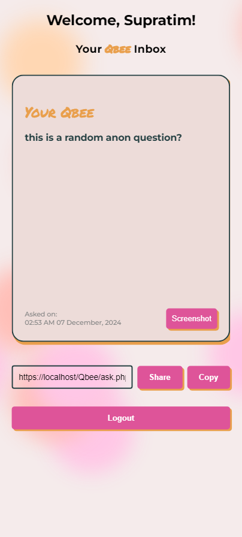
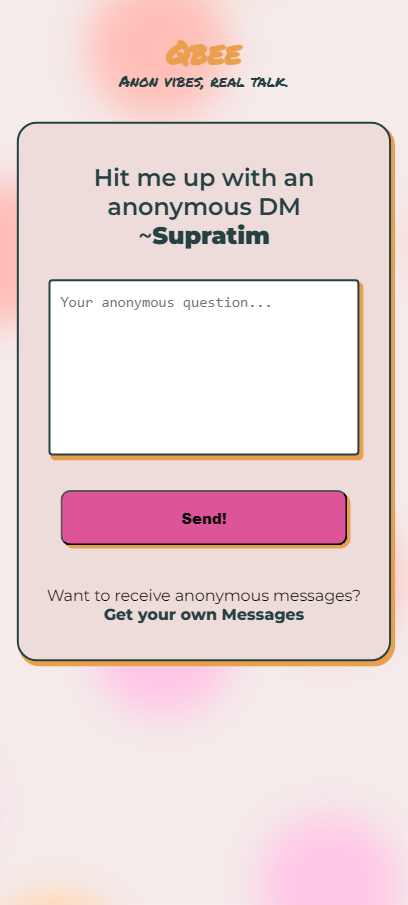
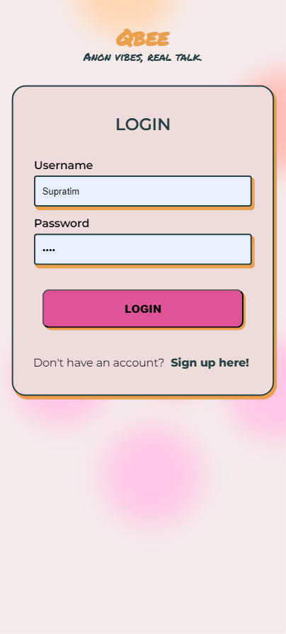
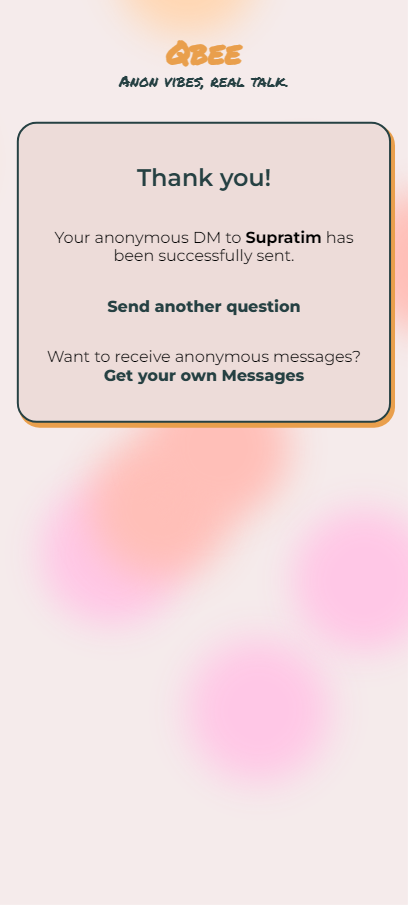

# Qbee Dashboard 📋✨

Welcome to the **Qbee Dashboard**, a dynamic and interactive web application designed to provide a seamless experience for managing and interacting with anonymous questions. Whether you're sharing your custom question link or exploring received messages, Qbee ensures a visually appealing and user-friendly environment. 🚀

---

## Features Overview 🛠️

### 1. **App Name & Tagline Display** 📛
- The dashboard prominently displays the app's name (**Qbee**) and its tagline (**Anon vibes, real talk**), creating a cohesive branding experience.
- Easily recognizable and consistent across all pages. 🌟

### 2. **Custom Anonymous Question Link** 🔗
- Generate a personalized link to share with your audience, allowing them to send you anonymous messages effortlessly.
- **Copy Button**: A handy button beside the link to quickly copy the URL to your clipboard.

### 3. **Horizontal Scrolling Anon Inbox** 📬
- Enjoy a sleek, card-based view for your questions.
- Cards are:
  - **Horizontally scrollable** using **Next** and **Previous** arrows.
  - Designed to display questions one at a time for better readability. 🧾
- Built with smooth animations and transitions for an intuitive experience.

### 4. **Card Structure** 🃏
- **Modern and Elegant Design**:
  - Styled to match the theme of the application.
  - Each card contains:
    - **Question text**.
    - **Date received**.
    - A **screenshot button** to save the card as an image.
- Fully responsive and visually engaging.

### 5. **Responsive Design** 📱
- Built with responsiveness in mind to ensure a consistent experience across devices.
- Includes:
  - Adaptive card sizes.
  - Media queries for optimal layout adjustments.

### 6. **User Authentication** 🔒
- Secure login system ensuring that only authorized users can access the dashboard.
- Users can log out at any time using the **Logout** button.

### 7. **Custom Styling** 🎨
- Aesthetic enhancements using the previous theme for consistency.
- Incorporates:
  - Cool, minimalistic color schemes.
  - Smooth hover effects on buttons and cards.
  - Accessible typography and layout.

---

## How to Use 🤔

### 1. **Login to Your Account**
- Navigate to the `login.php` page and enter your credentials.

### 2. **Access Your Dashboard**
- After logging in, you'll be directed to your personalized dashboard.
- Copy your custom anonymous link to share with others. 🔗

### 3. **View Your Questions**
- Explore questions sent to you through a beautifully designed horizontal card slider.
- Use the **Previous** and **Next** buttons to navigate between messages.
- Save any question card as a **screenshot** for future reference.

### 4. **Logout Safely**
- End your session securely by clicking the **Logout** button, which redirects you to `login.php`.

---

## Tech Stack 🖥️

### Frontend:
- **HTML5**: Structure of the application.
- **CSS3**: Styling, animations, and responsiveness.

### Backend:
- **PHP**: Handles server-side logic, user authentication, and database operations.
- **MySQL**: Stores user information and received questions.

### Additional Libraries:
- **JavaScript**: For dynamic interactions and card animations.

---

## Screenshots 📸

<table>
  <tr>
    <td align="center">
      
      <br/><em>Dashboard Overview</em>
    </td>
    <td align="center">
      
      <br/><em>Card View</em>
    </td>
  </tr>
  <tr>
    <td align="center">
      
      <br/><em>Login View</em>
    </td>
    <td align="center">
      
      <br/><em>Acknowledgement</em>
    </td>
  </tr>
</table>

---

## Setup Guide ⚙️

### 1. **Clone the Repo**
```bash
git clone https://github.com/your-username/qbee-dashboard.git
cd qbee-dashboard
```

### 2. **Create the MySQL Database**
Fire up your MySQL or phpMyAdmin and run this:
```sql
CREATE DATABASE qbee;

USE qbee;

CREATE TABLE users (
    id INT AUTO_INCREMENT PRIMARY KEY,
    username VARCHAR(50) NOT NULL UNIQUE,
    password VARCHAR(255) NOT NULL
);

CREATE TABLE questions (
    id INT AUTO_INCREMENT PRIMARY KEY,
    user_id INT,
    question_text TEXT NOT NULL,
    question_date TIMESTAMP DEFAULT CURRENT_TIMESTAMP,
    FOREIGN KEY (user_id) REFERENCES users(id)
);

/* Optional: Enable this if you want responses feature in the future
CREATE TABLE responses (
    id INT AUTO_INCREMENT PRIMARY KEY,
    question_id INT,
    response_text TEXT,
    response_date TIMESTAMP DEFAULT CURRENT_TIMESTAMP,
    FOREIGN KEY (question_id) REFERENCES questions(id)
);
*/
```

### 3. **Configure Your PHP App**
- Open the `config.php` file.
- Add your DB credentials:
```php
$host = 'localhost';
$db = 'qbee';
$user = 'your_mysql_user';
$pass = 'your_mysql_password';
```

### 4. **Start Your Local Server**
If using XAMPP:
- Move the folder to `htdocs/`.
- Open browser and visit `http://localhost/qbee-dashboard`.

If using PHP CLI:
```bash
php -S localhost:8000
```

---

## Future Enhancements 🚀
- **Dark Mode**: Add a toggle for light and dark themes.
- **Enhanced Sharing Options**: Share links directly to social media platforms.
- **Notifications**: Notify users when new questions are received.

---

## Contributing 🤝
We welcome contributions! To get started:
1. Fork this repository.
2. Create a new branch: `git checkout -b feature/YourFeature`.
3. Make your changes and commit them: `git commit -m 'Add some feature'`.
4. Push to the branch: `git push origin feature/YourFeature`.
5. Open a pull request.

---

## License 📄
This project is licensed under the MIT License. Feel free to use and modify it for your own projects.

---

## Contact Us 📬
Have any questions or feedback? Reach out to us at:
- **Email**: supratimrk@outlook.com
- **Twitter**: [@SupratimRK](https://twitter.com/SupratimRK)

---

Enjoy using Qbee! 🌟